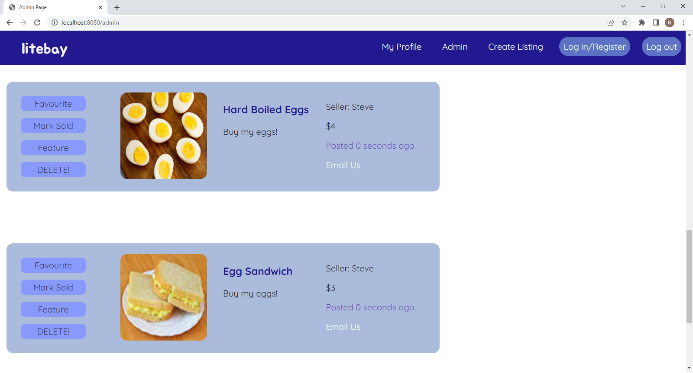
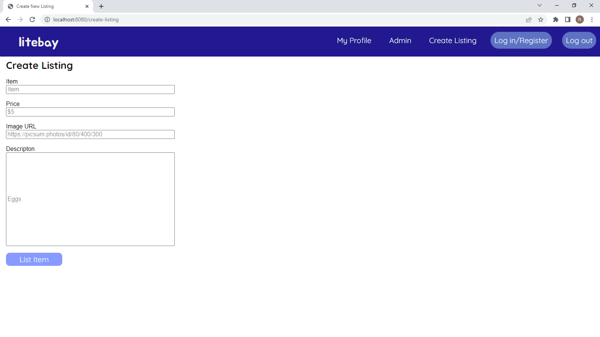
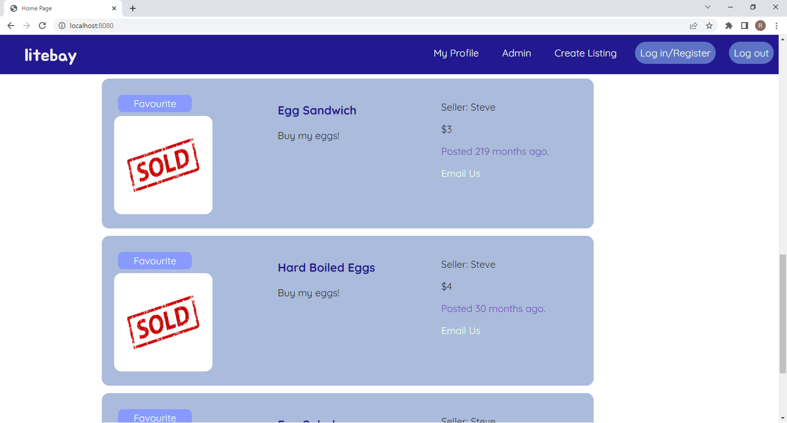
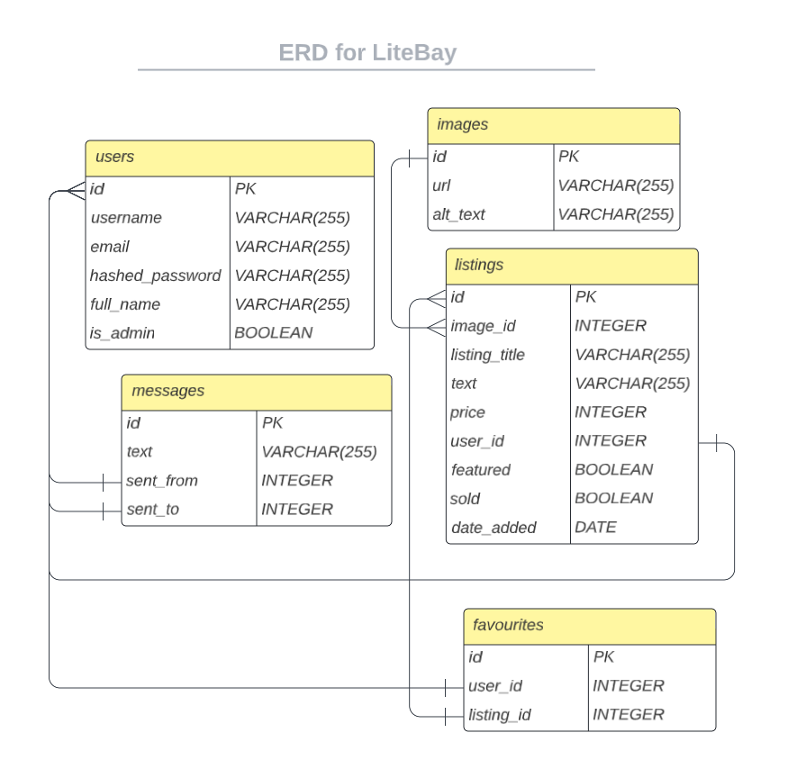

# Litebay

Litebay is a site designed as a buying/selling hub, where users can browse listings, keep track of items they have an eye on, and contact sellers regarding their listings. Litebay was a collaborative product built using EJS, jQuery, SASS, bcrypt, cookie session and Express.


## Dependencies

Each of the following is necessary in order to run litebay

- Node 10.x or above
- NPM 5.x or above
- PG 6.x or above

- bcryptjs: ^2.4.3,
- cookie-session: ^2.0.0,
- chalk: ^2.4.2,
- dotenv: ^2.0.0,
- ejs: ^2.6.2,
- express: ^4.17.1,
- morgan: ^1.9.1,
- pg: ^8.5.0,
- sass: ^1.35.1

## Steps for Installation

1. Clone the git repo

```sh
git clone git@github.com:facelessagony/Mid-Term.git
```

2. Install the npm packages

```sh
npm install
```

3. Reset database

```sh
npm run db:reset
```

---

## Accessing the site

1. Start up the server

```sh
npm run local
```

2. Enter the site from your browser

```sh
http://localhost:8080/
```

---

## Usage

* The Home page
 
 The home page displays all current listings to the user and gives them the option to sort them by pricing. The user can use the buttons on the navigation bar to log in, register, or visit other pages on the site.


* Favourites page

Once signed in, any user can add a listing to their favourites to easily access the listings they are interested in


* Admin options

Users logged into an admin account have the option to create and delete listings, and can mark them as sold.





---

## Database

Attached here is an Entity Relationship diagram used when designing the database for this project



## Collaborators

The Litebay project was put together by a team of 3 web development students at [Lighthouse Labs](https://www.lighthouselabs.ca/)

- [Eric Solomon](https://github.com/facelessagony)
- [Sid Natarajan](https://github.com/sidnat)
- [Ryan Zhen](https://github.com/Squoog)